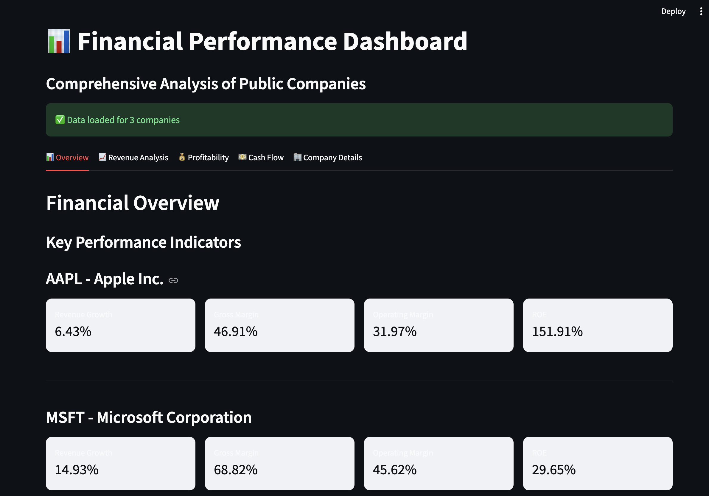
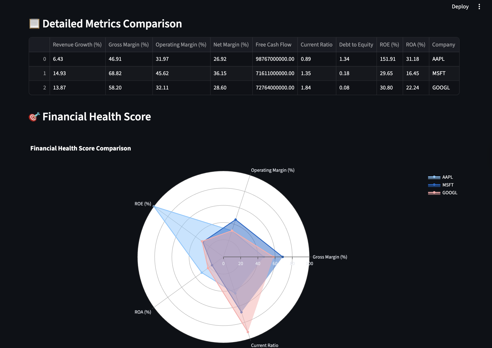
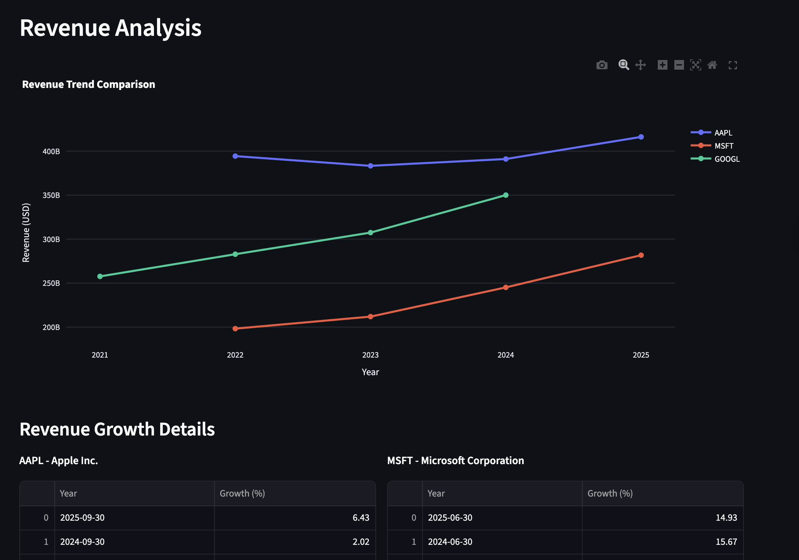
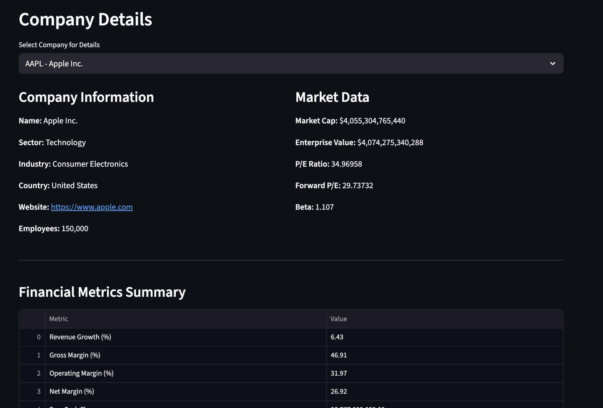

# 📊 Financial Performance Dashboard

## Link: [https://financialperformancedashboard.streamlit.app/]
A comprehensive financial analysis dashboard that visualizes and compares the performance of public companies using real-time data.


## 🎯 Project Overview

This interactive dashboard pulls financial statements (income statement, balance sheet, cash flow) for public companies and calculates key financial metrics including:

- Revenue Growth (YoY)
- Gross, Operating, and Net Margins
- Free Cash Flow
- Return on Equity (ROE) and Return on Assets (ROA)
- Current Ratio and Debt-to-Equity
- Financial Health Score

## 🚀 Features

- **Multi-Company Comparison**: Analyze up to 3+ companies simultaneously
- **Interactive Visualizations**: Built with Plotly for dynamic, interactive charts
- **Real-Time Data**: Fetches latest financial data from Yahoo Finance
- **Quarterly & Annual Views**: Toggle between different time periods
- **Financial Health Radar**: Visual representation of overall financial strength
- **Data Caching**: Reduces API calls and improves performance

## 🛠️ Technologies Used

- **Python 3.8+**
- **Streamlit**: Web application framework
- **Plotly**: Interactive visualizations
- **pandas**: Data manipulation and analysis
- **yfinance**: Financial data extraction
- **NumPy**: Numerical computations

## 📦 Installation

1. Clone the repository:
```bash
git clone https://github.com/YOUR_USERNAME/financial-performance-dashboard.git
cd financial-performance-dashboard
```

2. Create a virtual environment:
```bash
python -m venv venv
source venv/bin/activate  # On Windows: venv\Scripts\activate
```

3. Install dependencies:
```bash
pip install -r requirements.txt
```

## 🎮 Usage

1. Run the dashboard:
```bash
streamlit run app.py
```

2. Open your browser to `http://localhost:8501`

3. Select companies from the sidebar

4. Explore different tabs for various analyses

## 📊 Dashboard Sections

### Overview
- Key metrics at a glance
- Detailed comparison table
- Financial health radar chart



### Revenue Analysis
- Revenue trends over time
- Year-over-year growth rates
- Comparative analysis



### Profitability
- Margin comparisons
- Profitability trends
- Operating efficiency metrics



### Company Details
- Company information
- Market data
- Comprehensive financial summary


### Cash Flow
- Free cash flow trends
- Operating cash flow analysis
- Capital expenditure tracking


## 🗂️ Project Structure
